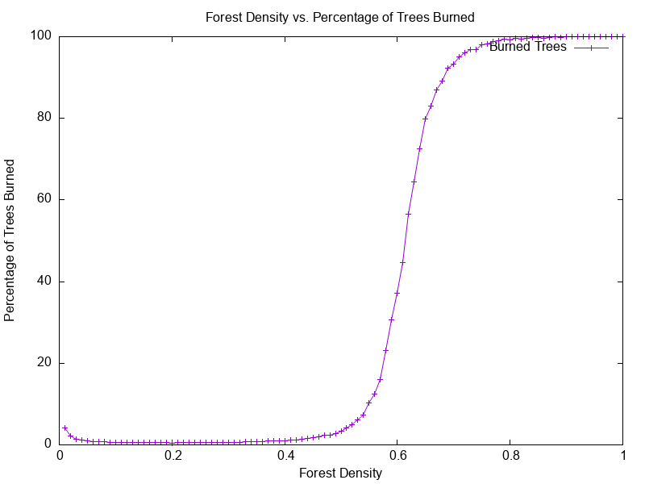

## Program symulujący spalanie się lasu.

- flaga s określa rozmiar lasu (domyślnie 50).  
- flaga d określa gęstość lasu (domyślnie 0.5).  
- flaga r pozwala na uruchomienie programu w trybie rekurencyjnym.  
- flaga c uruchamia obliczanie średniej ilości spalonych drzew dla 1000 lasów o różnych gęstościach.  

- wykres przedstawia procentową ilość spalonych drzew w zależności od gęstości zalesienia lasu

- przy 50% zalesienia lasu każde kolejne posadzenie drzewa diametralnie zwiększa szanse na pożar lasu
    - na wykresie widać że największy skok jest między 50% a 70% zalesienia
    - pniżej 50% zalesienia lasu pożary spalają bardzo małą ilość drzew
    - powyżej 70% zalesienia lasu pożary spalają większą część lasu
- warto też zauważyć, że przy bardzo małych gęstościach 1-4% zalesienia pożary są trochę bardziej poważne
    - dzieje się tak ponieważ program zawsze trafia w drzewo, a przy małych gęstościach zalesienia jest ich mniej

### Podsumowanie:
Z programu wynika że najlepszym rozwiązaniem jest zalesienie lasu na poziomie 50%. Przy takiej gęstości lasy spalają się w 3.5% całego lasu. Zaskakujące jest jak dużą różnicę robi 1% zalesienia lasu gdy jest ono na poziomie 50%. Wtedy procent spalonych drzew drastycznie rośnie.

