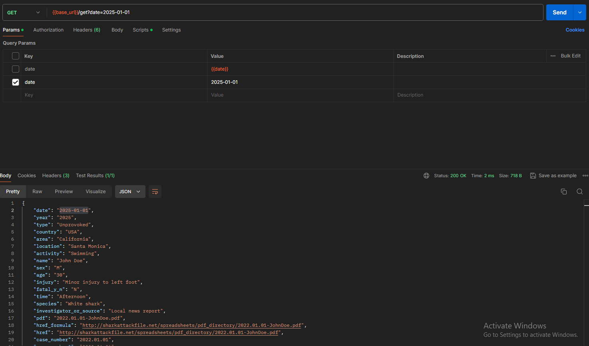
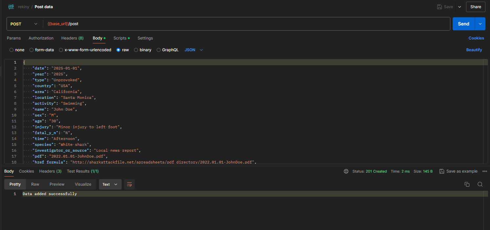
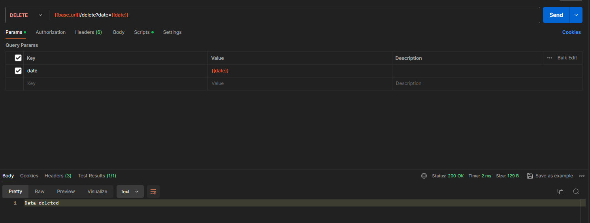
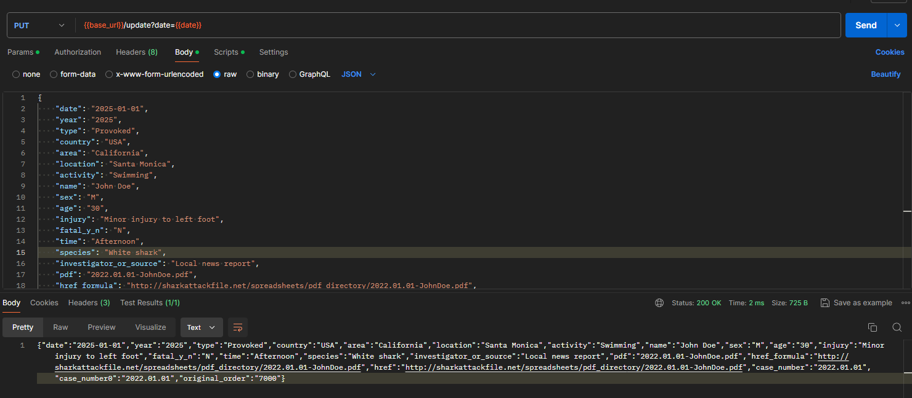

## Serwer w golangu, który obsługuje zapytania HTTP. Serwer ma obsługje 4 endpointy:
- '/get' - zwraca JSON z danymi o atakach rekinów z bazy danych, można filtrować po polu 'date'
- '/post' - dodaje nowy atak rekina do bazy danych
- '/delete' - usuwa atak rekina z bazy danych
- '/put' - aktualizuje dane ataku rekina w bazie danych

### Przykładowe zapytania:
- get: `curl -X GET http://localhost:8080/get`

- post: `curl -X POST http://localhost:8080/post -d '{
    "date": "2025-01-01",
    "year": "2025",
    "type": "Unprovoked",
    "country": "USA",
    "area": "California",
    "location": "Santa Monica",...
}`

- delete: `curl -X DELETE http://localhost:8080/delete?date=2025-01-01`

- put: `curl -X PUT http://localhost:8080/put?date=2025-01-01 -d '{
    "date": "2025-01-01",
    "year": "2025",
    "type": "Provoked",
    "country": "USA",
    "area": "California",
    "location": "Santa Monica",...
}`

### Podsumowanie:
Przyjemnie pracowało mi się z Go, w porównaniu do JavaScript jest szybszy i bardziej wydajny. Endpointy od razu zwracają status, nic nie zamula.